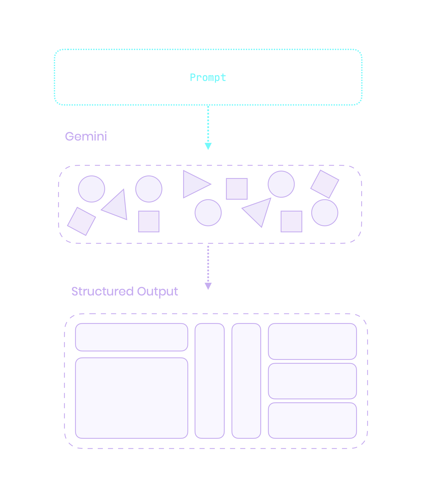

---

@column

## Another image Another image Another image Another image Another image Another image Another image Another image Another image Another image {.here}

@column

```mermaid
graph TD
    A[Start] --> B[Input]
    B --> C[Process]
    C --> D[Output]
    D --> E[End]
``` {.code}

---

---

@section
@section {flex: 2}
@column {
  align: center
  flex: 2
}


```dart
Column(
  crossAxisAlignment: CrossAxisAlignment.start,
  children: spans.map((span) {
    return RichText(
      text: TextSpan(
        style: interpolatedSpec.textStyle,
        children: [span],
      ),
    );
  }).toList(),
)
```{.code}

@column

 {.cover}

---


@column

## Another image{.here}

@column

 {.cover}

---

@column

 {.cover}

@dartpad {
  id: idhere
  code: ""
}

@column

## Yes different image{.here}

---

@column {
  align: center_right
}

#### Leo Farias
leoafarias{.here}


@column {
  align: center_left
}

- Founder/CEO/CTO
- Open Source Contributor
- Flutter & Dart GDE
- Passionate about UI/UX/DX

---

@column

@column {
  align: center_left 
  flex: 2
}
> [!WARNING]  
> This presentation contains live AI-generated content. Unexpected things may occur during the demonstration. 

@column

---


@column {
  flex: 2 
  align: center_right
}
### Generative UI
@column
## VS
@column {
  flex: 2
}
### AI Assisted Code Generation

---


### What is Generative UI?{.animate}

@column

- LLMs are great at generating content based on context
- GUIs are great at providing structured, interactive interfaces for user input and navigation

---

# LLM ❤️ GUI{.animate}


---

@column
@column {
  flex: 2
  align: center
}
Creates dynamic, context-aware UIs by interpreting actions and maintaining state with LLMs for fluid, interactive responses.{.animate}

@column

---

### Benefits of UI over Chat{.animate}

- More intuitive and user-friendly, especially for complex tasks
- Faster feedback loop between users and LLMs
- Enhances efficiency and interaction

---


@column {
  flex: 3 
  align: center
}
### Flutter is Well-Suited <br>for Generative UI
Built for any screen: Ideal for generating<br>adaptive UIs across devices and platforms.
@column

---


## How can LLMs Understtand Your UI?

@column



---

@column

### Structured Output

@column
```dart 
final schema = Schema.array(
  description: 'List of recipes',
  items: Schema.object(
    properties: {
      'recipeName': Schema.string(
        description: 'Name of the recipe.',
        nullable: false,
      ),
    },
    requiredProperties: ['recipeName'],
  ),
);
```

---

@section
```dart

final model = GenerativeModel(
  model: 'gemini-1.5-pro',
  apiKey: apiKey,
  generationConfig: GenerationConfig(
    responseMimeType: 'application/json',
    responseSchema: schema,
  ),
);

final prompt = 'List a few popular cookie recipes.';
final response = await model.generateContent([Content.text(prompt)]);

```

---

@column
### Color Palette Generator

Generate a color palette based on a given text.

- Name of the palette
- Font family
- Font color
- Color for each corner of the palette

--- 

@column
```dart
final schema = Schema.object(properties: {
  'name': Schema.string(
    description:
        'The text content to display on color palette. Format: #FF0000',
    nullable: false,
  ),
  'font': Schema.enumString(
    enumValues: ColorPaletteFontFamily.enumString,
    description: 'The font to use for the poster text.',
    nullable: false,
  ),
  'fontColor': Schema.string(
    description: 'The hex color value of the poster text. Format: #FF0000',
    nullable: false,
  ),
  'topLeftColor': Schema.string(
    description:
        'The hex color value top left corner of color palette. Format: #FF0000',
    nullable: false,
  ),
  'topRightColor': Schema.string(
    description:
        'The hex color value top right corner of color palette. Format: #FF0000',
    nullable: false,
  ),
  'bottomLeftColor': Schema.string(
    description:
        'The hex color value bottom left corner of color palette. Format: #FF0000',
    nullable: false,
  ),
  'bottomRightColor': Schema.string(
    description:
        'The hex color value bottom right corner of color palette. Format: #FF0000',
    nullable: false,
  )
}, requiredProperties: [
  'name',
  'font',
  'fontColor',
  'topLeftColor',
  'topRightColor',
  'bottomLeftColor',
  'bottomRightColor',
]);

```

---
style: demo
---

@colorPalette {
  schema: true
  prompts: [tropical, 
  vibrant, pastel, chocolatey pink unicorn, cyberpunk]
}
